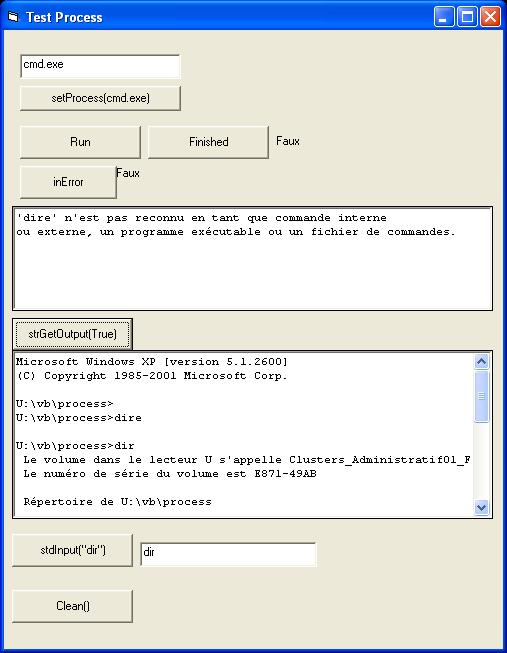



## Process Class

### Description

Handle process (in background) and trap all console inputs and outputs.

Inclute a test GUI to show how it works.
 
### More Info
 
A command line.

StdInput

'Init the class with setProcess()

'start process with Run()

'Check the state of execution with Finished()

'Then check if you get an error with inError()

'and get strOutput (with getstrOutput(TRUE)) or/and strError when needed

'use StdInput(strInput As String) to write to the process

'close the process with clean

'Dont forget that you need to Check the state of execution with Finished()

'before getting anyting from strOutput, strError or intError

StdOutput

StdError

Dos error level.

             |
---                |---
**Submitted On**   |2006-06-16 10:00:14
**By**             |[David Robitaille](https://github.com/Planet-Source-Code/PSCIndex/blob/master/ByAuthor/david-robitaille.md)
**Level**          |Advanced
**User Rating**    |4.0 (8 globes from 2 users)
**Compatibility**  |VB 6\.0
**Category**       |[Miscellaneous](https://github.com/Planet-Source-Code/PSCIndex/blob/master/ByCategory/miscellaneous__1-1.md)
**World**          |[Visual Basic](https://github.com/Planet-Source-Code/PSCIndex/blob/master/ByWorld/visual-basic.md)
**Archive File**   |[Process\_Cl2001256162006\.zip](https://github.com/Planet-Source-Code/david-robitaille-process-class__1-65681/archive/master.zip)

